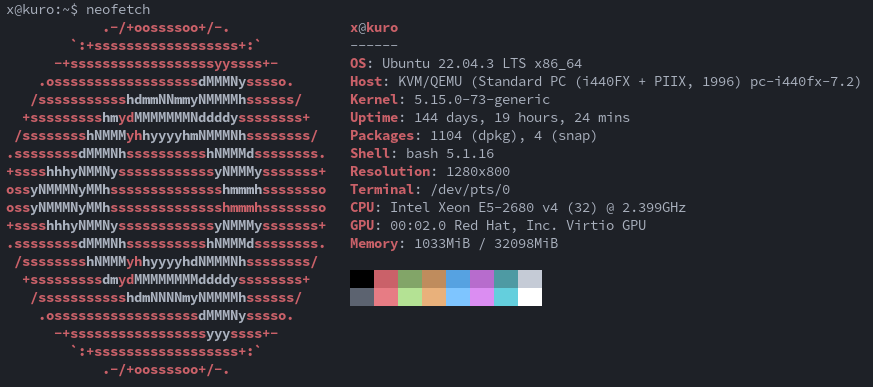

## Stack

- [Docker](https://www.docker.com/)
- [Docker Compose](https://docs.docker.com/compose/)
- [Cloudflare](https://www.cloudflare.com/)

## Deployment

### Prerequisites

- A VPS with [Docker](https://www.docker.com/) and [Docker Compose](https://docs.docker.com/compose/) installed
- [Git](https://git-scm.com/downloads)
- [OpenAI API Key](https://platform.openai.com/account/api-keys)
- A Domain that is already registered to [Cloudflare](https://www.cloudflare.com/)

### Setup

#### VPS

I personally recommend at least 8GB of RAM and 2 vCPUs for the VPS, for your reference, I run this project on a VPS with the following spec: 
Refer to [this guide](https://docs.docker.com/engine/install/) to install Docker and [this guide](https://docs.docker.com/compose/install/) to install Docker Compose

#### Domain

Refer to [this guide](https://developers.cloudflare.com/fundamentals/setup/account-setup/add-site/) to add your domain to Cloudflare

#### Steps

Once you complete all the previous setup, follow these steps to deploy a instance up and running:

1. Create the .env file: Rename the `.env.example` in the main directory to `.env`
2. Edit the `.env` file. Copy paste your `OPENAI_API_KEY` and `CLOUDFLARE_TOKEN` in the `.env` file.
   Please refer to [this guide](https://developers.cloudflare.com/cloudflare-one/connections/connect-networks/get-started/create-remote-tunnel/#1-create-a-tunnel) to learn how to create a cloudflare tunnel and get the token for connector.
   <a id="step-2"></a>

   I already setup the cloudflared service inside docker compose, so you only need to get the token, and `REMEMBER TO KEEP THE CREATE TUNNEL TAB OPEN SO WE CAN CONTINUE TO CONFIG AFTER RUNNING THINGS UP`

3. After already modifed the `.env` file. Simply do:

```bash
docker compose up -d --build
```

4. When the instance is up and running, go back to the create tab tunnel in [step 2](#step-2), refer to [this guide](https://developers.cloudflare.com/cloudflare-one/connections/connect-networks/get-started/create-remote-tunnel/#2-connect-an-application) to configure the address for the instance.

    Use `http`, `kurobase:3000` (this map to the container in the compose config, you can change it to whatever you want to) for service information.

That's all, just wait for the server to start, it may take a few minutes for the first time, you can check the container logs to see if the server has started.


#### Some notes
- The default credentials is admin/admin
- You can build a image and upload it to a container registry if you want to, I already set things up for that case in `docker` folder

